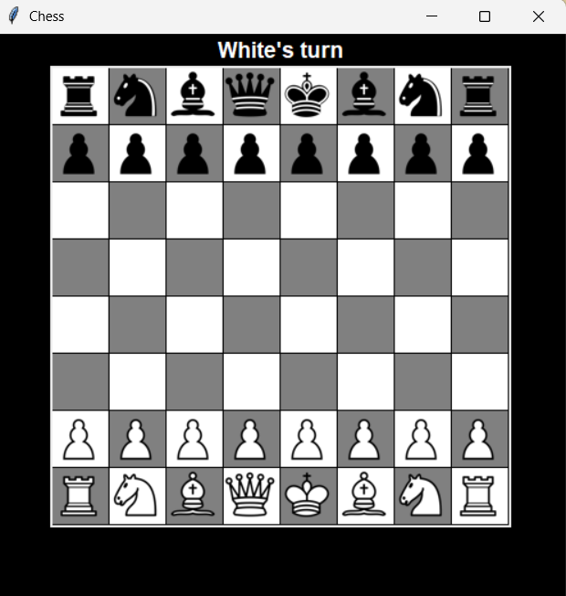

<h1 align="center">Chess in Python</h1>

## Table of content
- [How it works](#how-it-works)
  - [Board Setup](#board-setup)
  - [Piece Movement](#piece-movement)
  - [Check & Checkmate](#check--checkmate)
  - [Playing a Move](#playing-a-move)
  - [WorkFlow](#workflow)
- [Built With](#built-with)
- [Installation](#installation)
- [AI Usage](#ai-usage)
- [Author](#author)

## How it works

First, the program loads every piece image from the `pieces` folder and builds the tkinter window. A Start button is shown first; clicking it draws the board and the pieces and starts the game. From there, two players (White and Black) take turns clicking a piece and then clicking a highlighted square to move it, until one side is checkmated.

### Board Setup

`class Board`: Stores every square of the 8x8 board (`a1` to `h8`) in a dictionary, starting empty. `class Game`: Creates the board and calls `setup_pieces()`, which places all rooks, knights, bishops, queens, kings, and pawns in their standard starting positions, and keeps track of whose turn it is (`current_player`).

### Piece Movement

`class Piece`: Represents a single piece with a type, a color, and a position. `get_legal_moves()`: Calculates every move a piece could make based on its type: rooks, bishops, and queens slide in straight or diagonal directions until blocked, knights and kings check a fixed set of offsets, and pawns can move one or two squares forward, or capture diagonally. This does not account for castling, en passant, or pawn promotion.

### Check & Checkmate

`is_king_in_check()`: Looks through every enemy piece's legal moves to see if the king's square is being attacked. `get_safe_moves()`: Filters a piece's legal moves down to only the ones that do not leave its own king in check, by simulating each move on the board. `is_checkmate()`: Checks if the current player's king is in check and no piece has any safe move left.

### Playing a Move

`on_click()`: Handles clicks on the board. The first click selects one of the current player's pieces and highlights its safe moves in light blue (and the king's square in red if it's in check). The second click moves the piece there if the square is a legal move, then switches turns and checks the opponent for check or checkmate, updating the label above the board accordingly.

### WorkFlow

The program starts by running `load_images()` and `setup_pieces()`, then waits for the Start button to be clicked before drawing the board. From there it loops through player clicks, alternating turns with `switch_turn()`, until one player is checkmated.

## Built With
- Python
- tkinter Module
- Pillow (PIL) Module

## Installation
To Download it, check the latest Windows version from the **Releases** page.
Here → https://github.com/xtrawalo/Chess/releases/latest

## AI USAGE
This project is my own work. I used Claude only for debugging.

## Author
Me : [xtrawalo](https://github.com/xtrawalo)
